# GraphTalk

**[English](README.md)** | **[Русский](docs/ru/README.md)**

A comprehensive knowledge base management and query system for OSTIS with REST API, LLM integration, semantic processing, multi-tenant architecture, and advanced analytics capabilities.

```mermaid

flowchart TD
    %% Clients Layer
    subgraph "Clients"
        StreamlitUI["Streamlit Web UI"]:::client
        click StreamlitUI "https://github.com/wafflelover404/graphtalk-sc/blob/main/ui/sc_machine_ui.py"
        TelegramUI["Telegram Bot UI"]:::client
        click TelegramUI "https://github.com/wafflelover404/graphtalk-sc/blob/main/ui/tg_bot.py"
        CLI["CLI (curl/Postman)"]:::client
        ReactUI["React Frontend<br/>wiki-ai-react"]:::client
        click ReactUI "https://github.com/wafflelover404/wiki-ai-react"
    end

    %% API Layer
    subgraph "API Layer"
        APIGateway["API Gateway<br/>(src/api.py)"]:::api
        click APIGateway "https://github.com/wafflelover404/graphtalk-sc/blob/main/src/api.py"
        SCServer["SC-machine API Server<br/>(api_sc.py)"]:::api
        click SCServer "https://github.com/wafflelover404/graphtalk-sc/blob/main/api_sc.py"
        Auth["Auth Module<br/>(src/rag_security.py)"]:::api
        click Auth "https://github.com/wafflelover404/graphtalk-sc/blob/main/src/rag_security.py"
        MetricsMW["Metrics Middleware<br/>(src/metrics_middleware.py)"]:::api
        click MetricsMW "https://github.com/wafflelover404/graphtalk-sc/blob/main/src/metrics_middleware.py"
        MetricsAdmin["Metrics API (Admin)<br/>(src/metrics_api.py)"]:::api
        click MetricsAdmin "https://github.com/wafflelover404/graphtalk-sc/blob/main/src/metrics_api.py"
        MetricsUser["Metrics API (User)<br/>(src/metrics_user_api.py)"]:::api
        click MetricsUser "https://github.com/wafflelover404/graphtalk-sc/blob/main/src/metrics_user_api.py"
        ReportsAPI["Reporting API<br/>(src/reports_api.py)"]:::api
        click ReportsAPI "https://github.com/wafflelover404/graphtalk-sc/blob/main/src/reports_api.py"
        AnalyticsAPI["Analytics API<br/>(src/advanced_analytics_api.py)"]:::api
        click AnalyticsAPI "https://github.com/wafflelover404/graphtalk-sc/blob/main/src/advanced_analytics_api.py"
        CMSAPI["CMS API<br/>(landing-pages-api/)"]:::api
        click CMSAPI "https://github.com/wafflelover404/graphtalk-sc/blob/main/src/landing-pages-api/"
    end

    %% Knowledge Base Modules
    subgraph "Knowledge Base Layer"
        SearchBasic["Basic Search<br/>(sc_search.py)"]:::api
        click SearchBasic "https://github.com/wafflelover404/graphtalk-sc/blob/main/sc_search.py"
        SearchAdv["Advanced Search<br/>(sc_search-total.py)"]:::api
        click SearchAdv "https://github.com/wafflelover404/graphtalk-sc/blob/main/sc_search-total.py"
        MemLoader["Memory Loader<br/>(memloader.py)"]:::api
        click MemLoader "https://github.com/wafflelover404/graphtalk-sc/blob/main/memloader.py"
        JSONInterp["JSON Interpreter<br/>(json_interpreter.py)"]:::api
        click JSONInterp "https://github.com/wafflelover404/graphtalk-sc/blob/main/json_interpreter.py"
        Reindex["Reindex Docs<br/>(reindex_documents.py)"]:::api
        click Reindex "https://github.com/wafflelover404/graphtalk-sc/blob/main/reindex_documents.py"
    end

    %% LLM Modules
    subgraph "LLM Layer"
        LLMCore["LLM Core<br/>(src/llm.py)"]:::api
        click LLMCore "https://github.com/wafflelover404/graphtalk-sc/blob/main/src/llm.py"
        LLMJson["LLM JSON Conv.<br/>(json_llm.py)"]:::api
        click LLMJson "https://github.com/wafflelover404/graphtalk-sc/blob/main/json_llm.py"
    end

    %% RAG Microservice
    subgraph "RAG Microservice"
        RAG_Main["Main Server<br/>(src/rag_api/main.py)"]:::api
        click RAG_Main "https://github.com/wafflelover404/graphtalk-sc/blob/main/src/rag_api/main.py"
        ChromaUtil["Chroma Utils<br/>(src/rag_api/chroma_utils.py)"]:::api
        click ChromaUtil "https://github.com/wafflelover404/graphtalk-sc/blob/main/src/rag_api/chroma_utils.py"
        LCUtil["LangChain Utils<br/>(src/rag_api/langchain_utils.py)"]:::api
        click LCUtil "https://github.com/wafflelover404/graphtalk-sc/blob/main/src/rag_api/langchain_utils.py"
        PydModels["Pydantic Models<br/>(src/rag_api/pydantic_models.py)"]:::api
        click PydModels "https://github.com/wafflelover404/graphtalk-sc/blob/main/src/rag_api/pydantic_models.py"
        DBUtils["DB Utils<br/>(src/rag_api/db_utils.py)"]:::api
        click DBUtils "https://github.com/wafflelover404/graphtalk-sc/blob/main/src/rag_api/db_utils.py"
    end

    %% Data Stores
    subgraph "Data Stores"
        UserDB["User Tokens DB<br/>(src/userdb.py)"]:::db
        click UserDB "https://github.com/wafflelover404/graphtalk-sc/blob/main/src/userdb.py"
        UploadsDB["Uploads DB<br/>(src/uploadsdb.py)"]:::db
        click UploadsDB "https://github.com/wafflelover404/graphtalk-sc/blob/main/src/uploadsdb.py"
        MetricsDB["Metrics DB<br/>(src/metricsdb.py)"]:::db
        click MetricsDB "https://github.com/wafflelover404/graphtalk-sc/blob/main/src/metricsdb.py"
        ReportsDB["Reports DB<br/>(src/reports_db.py)"]:::db
        click ReportsDB "https://github.com/wafflelover404/graphtalk-sc/blob/main/src/reports_db.py"
        AnalyticsDB["Analytics DB<br/>(src/analytics_core.py)"]:::db
        click AnalyticsDB "https://github.com/wafflelover404/graphtalk-sc/blob/main/src/analytics_core.py"
        OrgDB["Organizations DB<br/>(src/orgdb.py)"]:::db
        click OrgDB "https://github.com/wafflelover404/graphtalk-sc/blob/main/src/orgdb.py"
        QuizDB["Quiz DB<br/>(src/quizdb.py)"]:::db
        click QuizDB "https://github.com/wafflelover404/graphtalk-sc/blob/main/src/quizdb.py"
        APIKeysDB["API Keys DB<br/>(src/api_keys.py)"]:::db
        click APIKeysDB "https://github.com/wafflelover404/graphtalk-sc/blob/main/src/api_keys.py"
        ChromaDB["Chroma Store"]:::db
        FS["File Storage<br/>uploaded_kbs/, unpacked_kbs/"]:::db
    end

    %% External Services
    subgraph "External Services"
        SCMachine["OSTIS SC-machine WS"]:::external
        LLMService["DeepSeek/GPT-4o-mini/Gemini"]:::external
    end

    %% Connections
    StreamlitUI -->|HTTP| APIGateway
    TelegramUI -->|HTTP| APIGateway
    CLI -->|HTTP| APIGateway
    ReactUI -->|HTTP| APIGateway

    APIGateway -->|WebSocket| SCMachine
    APIGateway -->|POST /query| SearchBasic
    APIGateway -->|POST /query/adv| SearchAdv
    APIGateway -->|POST /upload| MemLoader
    APIGateway -->|interpret| JSONInterp
    APIGateway -->|reindex| Reindex
    SearchBasic -->|WS call| SCMachine
    SearchAdv -->|WS call| SCMachine
    MemLoader -->|WS load| SCMachine
    JSONInterp -->|WS interpret| SCMachine
    MemLoader -->|store files| FS
    JSONInterp -->|store files| FS

    APIGateway -->|calls| LLMCore
    LLMCore -->|formats| LLMJson
    LLMJson -->|response| APIGateway
    APIGateway -->|HTTP| LLMService

    APIGateway -->|metrics| MetricsMW
    MetricsMW -->|write| MetricsDB
    AnalyticsAPI -->|analytics| AnalyticsDB

    APIGateway -->|auth| UserDB
    APIGateway -->|orgs| OrgDB
    APIGateway -->|metadata| UploadsDB
    ReportsAPI -->|read/write| ReportsDB
    APIGateway -->|reporting| ReportsAPI
    APIGateway -->|quiz| QuizDB
    APIGateway -->|api keys| APIKeysDB

    APIGateway -->|HTTP| RAG_Main
    RAG_Main -->|uses| ChromaDB
    RAG_Main -->|util| ChromaUtil
    RAG_Main -->|util| LCUtil
    RAG_Main -->|models| PydModels
    RAG_Main -->|db util| DBUtils

    %% Styles
    classDef api fill:#CFE2FF,stroke:#03396c,color:#03396c
    classDef db fill:#D5E8D4,stroke:#2E7D32,color:#2E7D32
    classDef external fill:#FFEAC8,stroke:#E65100,color:#E65100
    classDef client fill:#EAD1DC,stroke:#880E4F,color:#880E4F

```


**Updated: February 2026**

## Overview
GraphTalk provides a secure, feature-rich interface for interacting with OSTIS knowledge bases through:
- **REST API**: Secure endpoints with bearer token authentication and multi-tenant support
- **Knowledge Base Search**: Multiple search algorithms including AI-agent enhanced search
- **LLM Integration**: Multi-provider support (DeepSeek, GPT-4o-mini, Gemini) with intelligent fallback
- **File Management**: Upload and process knowledge base files with comprehensive metadata
- **Semantic Processing**: Convert natural language to structured semantic representations
- **Advanced Analytics**: Real-time metrics, performance tracking, and user behavior analytics
- **Organization Management**: Multi-tenant architecture with invite-based user management
- **Content Management**: Integrated CMS for blog posts, help articles, and media
- **Quiz System**: Interactive quiz creation and management with analytics
- **API Key Management**: Secure API key generation with granular permissions

## Key Features
- 🔐 **Secure API**: Token-based authentication with bcrypt hashing and API key management
- 🔍 **Advanced Search System**: Standard search, AI-agent enhanced search, and RAG capabilities
- 🤖 **Multi-LLM Integration**: DeepSeek (preferred), GPT-4o-mini, and Gemini with automatic fallback
- 📁 **Comprehensive File Processing**: Upload ZIP files containing SCS knowledge base files
- 🌐 **WebSocket Connection**: Direct integration with OSTIS SC-machine
- 📊 **Advanced Analytics**: Real-time metrics, query volume tracking, and user behavior analysis
- 🏢 **Multi-Tenant Architecture**: Organization-based access control and management
- 📝 **Content Management**: Full CMS for blogs, help articles, and media management
- 🎯 **Quiz System**: Interactive quizzes with detailed analytics and reporting
- 🔑 **API Key Management**: Granular permissions and usage tracking
- 📖 **Interactive Documentation**: Swagger UI with authentication
- 🌍 **Internationalization**: Support for English and Russian languages

## Prerequisites
- Python 3.9+
- OSTIS SC-machine running locally (`ws://localhost:8090/ws_json`)
- Required Python packages (see requirements.txt)

## Installation
1. Clone the repository:
```bash
git clone https://github.com/Wafflelover404/GraphTalk
cd GraphTalk
```

2. Install dependencies:
```bash
pip install -r requirements.txt
```

3. Verify OSTIS connection:
```bash
python socket-client.py
```
Expected output: "Connected to the server !"

## Quick Start

### 1. Start the API Server
```bash
cd src
python api.py
```
The API will be available at `http://localhost:9001`

### 2. Create Access Token (One-time setup)
```bash
curl -X POST http://localhost:9001/create_token
```
Save the returned token - it will only be shown once!

### 3. Create an Organization (Optional for multi-tenant setup)
```bash
curl -X POST http://localhost:9001/organizations \
  -H "Authorization: Bearer YOUR_TOKEN" \
  -H "Content-Type: application/json" \
  -d '{"name": "My Organization", "slug": "my-org", "description": "Test organization"}'
```

### 4. Query the Knowledge Base
```bash
# Basic search
curl -X POST http://localhost:9001/query \
  -H "Authorization: Bearer YOUR_TOKEN" \
  -H "Content-Type: application/json" \
  -d '{"text": "OSTIS technology"}'

# AI-agent enhanced search
curl -X POST "http://localhost:9001/query?ai_agent=true" \
  -H "Authorization: Bearer YOUR_TOKEN" \
  -H "Content-Type: application/json" \
  -d '{"text": "What is OSTIS?"}'

# Humanized response with LLM
curl -X POST "http://localhost:9001/query?humanize=true" \
  -H "Authorization: Bearer YOUR_TOKEN" \
  -H "Content-Type: application/json" \
  -d '{"text": "What is OSTIS?"}'
```

### 5. Alternative UI Access Methods

#### React Frontend (Recommended)
```bash
cd ../wiki-ai-react
pnpm install
pnpm dev
```
Access at `http://localhost:3000`

#### Streamlit Web Interface
```bash
# Launch web UI
streamlit run ui/sc_machine_ui.py
```
Access at `http://localhost:8501`

#### Telegram Bot
```bash
# Configure bot token in ui/tg_bot.py and run
python ui/tg_bot.py
```

## API Endpoints

### Authentication
- **POST /create_token**: Generate access token (one-time only)
- **POST /login**: User login with email/password
- **POST /logout**: User logout
- **GET /**: API information and endpoint overview

### Organization Management
- **POST /organizations**: Create new organization
- **GET /organizations**: List organizations
- **POST /organizations/approve/{org_id}**: Approve organization
- **POST /organizations/reject/{org_id}**: Reject organization
- **POST /organizations/change-status/{org_id}**: Change organization status

### Core Operations
- **POST /query**: Search knowledge base with optional LLM humanization
  - Query parameters: `humanize=true`, `ai_agent=true` for enhanced responses
- **POST /upload/kb_zip**: Upload ZIP files containing .scs knowledge base files
- **POST /upload/kb_nlp_text**: Convert plain text to semantic JSON and load into SC-memory
- **GET /docs**: Interactive API documentation (requires authentication)

### Analytics & Metrics
- **GET /metrics**: System metrics and analytics
- **GET /metrics/volume**: Query volume data
- **GET /analytics**: Advanced analytics data
- **GET /reports**: Generate reports

### Content Management (CMS)
- **GET /api/cms/blog/posts**: List blog posts
- **POST /api/cms/blog/posts**: Create blog post
- **PUT /api/cms/blog/posts/{post_id}**: Update blog post
- **DELETE /api/cms/blog/posts/{post_id}**: Delete blog post
- **GET /api/cms/help/articles**: List help articles
- **POST /api/cms/help/articles**: Create help article
- **GET /api/cms/media/{filename}**: Get media file
- **POST /api/cms/media/upload**: Upload media file

### Quiz Management
- **GET /quizzes**: List quizzes
- **POST /quizzes**: Create quiz
- **GET /quizzes/{quiz_id}**: Get quiz details
- **POST /quizzes/{quiz_id}/submit**: Submit quiz response

### API Key Management
- **POST /api-keys**: Create API key
- **GET /api-keys**: List API keys
- **PUT /api-keys/{key_id}**: Update API key
- **DELETE /api-keys/{key_id}**: Revoke API key

## Module Overview

### Core API (`src/api.py`)
- FastAPI application with secure authentication and multi-tenant support
- File upload and processing capabilities
- Integration with search, LLM, analytics, and CMS modules
- WebSocket support for real-time streaming queries
- Comprehensive API key management system

### Analytics & Metrics (`src/analytics_core.py`, `src/advanced_analytics_api.py`)
- Real-time query volume tracking and performance metrics
- User behavior analytics and engagement tracking
- Security event monitoring and reporting
- Daily aggregated data with gap filling
- Configurable time periods and scope filtering

### Database Modules
- **User Management (`src/userdb.py`)**: Multi-tenant user authentication and session management
- **Organization Management (`src/orgdb.py`)**: Organization lifecycle and invite system
- **API Keys (`src/api_keys.py`)**: Secure API key generation with granular permissions
- **Quiz System (`src/quizdb.py`, `src/quiz_management.py`)**: Interactive quiz creation and analytics
- **Analytics (`src/analytics_core.py`)**: Comprehensive analytics data storage
- **Uploads (`src/uploadsdb.py`)**: File metadata and management
- **Messages (`src/messages_db.py`)**: Internal messaging and notifications

### Search Modules
1. **Basic Search (`sc_search.py`)**:
   - Fast, non-recursive search
   - Substring-based matching
   - Returns keynodes and link content

2. **Advanced Search (`sc_search-total.py`)**:
   - Recursive knowledge graph traversal
   - Configurable depth exploration
   - Multi-directional relationship mapping
   - Structured nested results

3. **AI-Agent Enhanced Search**:
   - Enhanced search strategy with AI processing
   - Relevance scoring and ranking
   - Context-aware result processing
   - Real-time streaming responses

### LLM Integration (`src/llm.py`)
1. **Multi-Provider Support**:
   - DeepSeek (preferred), GPT-4o-mini, Gemini
   - Automatic fallback between providers
   - Environment-based configuration
   - Cost-effective processing

2. **Semantic Parsing (`json-llm.py`)**:
   - Converts natural language to SC-Machine JSON format
   - Follows formal semantic specification
   - Supports Russian language processing

### RAG Microservice (`src/rag_api/`)
- **Chroma Vector Database**: Semantic document storage and retrieval
- **Document Processing**: Automatic chunking and embedding
- **Vector Search**: Fast similarity-based document retrieval
- **Performance Tracking**: Query timing and optimization

### Content Management (`src/landing-pages-api/`)
- **Blog Management**: Create, edit, and publish blog posts
- **Help Center**: Manage help articles and documentation
- **Media Management**: File upload and media organization
- **Content Statistics**: Track content engagement and usage

### Security (`src/rag_security.py`)
- **RAG Security**: Secure document retrieval with access control
- **Authentication**: Multi-factor authentication support
- **Authorization**: Role-based access control
- **Audit Logging**: Comprehensive security event tracking

### Data Processing
- **JSON Interpreter (`json_interpreter.py`)**: Loads semantic JSON data into SC-memory
- **Knowledge Base Loader (`memloader.py`)**: Batch process SCS files

### User Interfaces
1. **Streamlit UI (`ui/sc_machine_ui.py`)**:
   - Web-based graphical interface for API interaction
   - Token management and server connection testing
   - File upload and knowledge base querying capabilities

2. **Telegram Bot (`ui/tg_bot.py`)**:
   - Telegram bot interface for mobile/remote access
   - Interactive commands for all API operations
   - Session management for multiple users

### Utilities
- **Connection Tester (`socket-client.py`)**: Verify OSTIS connectivity
- **JSON Standard (`json-prompt.md`)**: Semantic conversion specification

## Project Structure
```
GraphTalk/
├── src/                       # Main source directory
│   ├── api.py                 # Main FastAPI application
│   ├── llm.py                 # Multi-provider LLM integration
│   ├── rag_security.py        # Security and authentication
│   ├── analytics_core.py     # Analytics engine
│   ├── advanced_analytics_api.py # Analytics API endpoints
│   ├── userdb.py             # User management database
│   ├── orgdb.py              # Organization management
│   ├── api_keys.py           # API key management
│   ├── quizdb.py            # Quiz database
│   ├── quiz_management.py    # Quiz system logic
│   ├── messages_db.py        # Messaging system
│   ├── uploadsdb.py          # File upload tracking
│   ├── metricsdb.py          # Metrics storage
│   ├── reports_db.py         # Reports database
│   ├── metrics_middleware.py # Metrics collection
│   ├── metrics_api.py        # Metrics endpoints
│   ├── metrics_user_api.py   # User metrics
│   ├── reports_api.py        # Reporting endpoints
│   ├── performance_analytics.py # Performance tracking
│   ├── security_analytics.py # Security monitoring
│   ├── user_behavior_analytics.py # User analytics
│   ├── rag_api/              # RAG microservice
│   │   ├── main.py          # RAG server
│   │   ├── chroma_utils.py  # ChromaDB utilities
│   │   ├── langchain_utils.py # LangChain integration
│   │   ├── pydantic_models.py # Data models
│   │   ├── db_utils.py      # Database utilities
│   │   ├── document_loaders.py # Document processing
│   │   └── timing_utils.py  # Performance tracking
│   ├── landing-pages-api/    # CMS system
│   │   ├── routers/         # API routers
│   │   ├── models/          # Data models
│   │   └── database/        # Database setup
│   └── integration_toolkit/  # Integration tools
├── sc_search.py             # Basic KB search module
├── sc_search-total.py       # Advanced recursive search
├── json_llm.py             # Natural language to JSON conversion
├── json_interpreter.py     # JSON to SC-memory loader
├── memloader.py            # SCS file batch processor
├── socket-client.py        # OSTIS connection test utility
├── ui/                    # User interface modules
│   ├── sc_machine_ui.py   # Streamlit web interface
│   └── tg_bot.py          # Telegram bot interface
├── docs/                  # Comprehensive documentation
│   ├── en/                # English documentation
│   └── ru/                # Russian documentation
└── wiki-ai-react/         # React frontend application
    ├── app/               # Next.js app router pages
    ├── components/        # React components
    ├── lib/              # Utilities and API client
    └── public/           # Static assets
```

## Project Documentation

Documentation for individual components can be found in the `docs/` directory:

- [API Module](docs/en/api.md): Documentation for `api.py`, detailing API endpoints and security features.
- [Basic Search Module](docs/en/sc_search.md): Details on `sc_search.py` for quick non-recursive knowledge base search.
- [Advanced Search Module](docs/en/sc_search-total.md): Details on `sc_search-total.py` for recursive knowledge base exploration.
- [LLM Integration](docs/en/llm.md): Information on `llm.py` for language model integration and response generation.
- [JSON LLM Converter](docs/en/json-llm.md): Guide for `json_llm.py` explaining JSON generation from text.
- [Knowledge Base Loader](docs/en/memloader.md): Instructions for `memloader.py` to process SCS files.
- [SC-Machine JSON Standard](docs/en/json-prompt.md): Specification details for semantic JSON conversion.
- [NLP JSON Interpretation & LLM Integration](docs/en/nlp_json_interpretation.md)

## Troubleshooting

### Connection Issues
- **OSTIS Server**: Verify OSTIS server is running at `ws://localhost:8090/ws_json`
- **Test Connection**: Run `python socket-client.py`
- **Expected Output**: "Connected to the server !"
- **Port Check**: Ensure port 8090 is not blocked by firewall

### Authentication Issues
- **Token Creation**: Only one token can be created per installation
- **Token Storage**: Token is stored in `~/secrets.toml`
- **Reset Token**: Delete `~/secrets.toml` to create a new token

### Search Issues
- **Empty Results**: Knowledge base may not contain relevant data
- **Search Terms**: Use specific terms that match KB content
- **Connection**: Verify OSTIS connection before searching

### LLM Issues
- **Internet Connection**: Required for GPT-4o-mini access
- **API Limits**: g4f client may have rate limits
- **Fallback**: API returns raw KB results if LLM fails

### File Upload Issues
- **File Format**: Only .zip files containing .scs files are accepted
- **Extraction**: Temporary files are stored in `unpacked_kbs/`
- **Permissions**: Ensure write permissions for upload directories

## Development

### Running Individual Modules
```bash
# Test OSTIS connection
python socket-client.py

# Test basic knowledge base search
python sc_search.py

# Test JSON conversion
python json-llm.py

# Test file loading
python memloader.py
```

### Environment Configuration
- **OSTIS URL**: Configurable in each module (default: `ws://localhost:8090/ws_json`)
- **API Port**: Configurable in `api.py` (default: 9001)
- **Upload Directories**: `uploaded_kbs/` and `unpacked_kbs/`

## License
This project is licensed under the GNU General Public License v3.0 - see the [LICENSE](LICENSE) file for details.

## Contributing
Contributions are welcome! Please consider:
- Adding new search algorithms
- Improving LLM integration
- Enhancing security features
- Writing additional documentation
- Adding test coverage
