# GraphTalk

**[English](docs/en/README.md)** | **Русский**

A comprehensive knowledge base management and query system for OSTIS with REST API, LLM integration, and semantic processing capabilities.

```mermaid

flowchart TD
    %% Clients Layer
    subgraph "Clients"
        StreamlitUI["Streamlit Web UI"]:::client
        click StreamlitUI "https://github.com/wafflelover404/graphtalk-sc/blob/main/ui/sc_machine_ui.py"
        TelegramUI["Telegram Bot UI"]:::client
        click TelegramUI "https://github.com/wafflelover404/graphtalk-sc/blob/main/ui/tg_bot.py"
        CLI["CLI (curl/Postman)"]:::client
    end

    %% API Layer
    subgraph "API Layer"
        APIGateway["API Gateway<br/>(api.py)"]:::api
        click APIGateway "https://github.com/wafflelover404/graphtalk-sc/blob/main/api.py"
        SCServer["SC-machine API Server<br/>(api_sc.py)"]:::api
        click SCServer "https://github.com/wafflelover404/graphtalk-sc/blob/main/api_sc.py"
        Auth["Auth Module"]:::api
        click Auth "https://github.com/wafflelover404/graphtalk-sc/blob/main/rag_security.py"
        MetricsMW["Metrics Middleware"]:::api
        click MetricsMW "https://github.com/wafflelover404/graphtalk-sc/blob/main/metrics_middleware.py"
        MetricsAdmin["Metrics API (Admin)"]:::api
        click MetricsAdmin "https://github.com/wafflelover404/graphtalk-sc/blob/main/metrics_api.py"
        MetricsUser["Metrics API (User)"]:::api
        click MetricsUser "https://github.com/wafflelover404/graphtalk-sc/blob/main/metrics_user_api.py"
        ReportsAPI["Reporting API<br/>(reports_api.py)"]:::api
        click ReportsAPI "https://github.com/wafflelover404/graphtalk-sc/blob/main/reports_api.py"
    end

    %% Knowledge Base Modules
    subgraph "Knowledge Base Layer"
        SearchBasic["Basic Search<br/>(sc_search.py)"]:::api
        click SearchBasic "https://github.com/wafflelover404/graphtalk-sc/blob/main/sc_search.py"
        SearchAdv["Advanced Search<br/>(sc_search-total.py)"]:::api
        click SearchAdv "https://github.com/wafflelover404/graphtalk-sc/blob/main/sc_search-total.py"
        MemLoader["Memory Loader<br/>(memloader.py)"]:::api
        click MemLoader "https://github.com/wafflelover404/graphtalk-sc/blob/main/memloader.py"
        JSONInterp["JSON Interpreter<br/>(json_interpreter.py)"]:::api
        click JSONInterp "https://github.com/wafflelover404/graphtalk-sc/blob/main/json_interpreter.py"
        Reindex["Reindex Docs<br/>(reindex_documents.py)"]:::api
        click Reindex "https://github.com/wafflelover404/graphtalk-sc/blob/main/reindex_documents.py"
    end

    %% LLM Modules
    subgraph "LLM Layer"
        LLMCore["LLM Core<br/>(llm.py)"]:::api
        click LLMCore "https://github.com/wafflelover404/graphtalk-sc/blob/main/llm.py"
        LLMJson["LLM JSON Conv.<br/>(json_llm.py)"]:::api
        click LLMJson "https://github.com/wafflelover404/graphtalk-sc/blob/main/json_llm.py"
    end

    %% RAG Microservice
    subgraph "RAG Microservice"
        RAG_Main["Main Server<br/>(rag_api/main.py)"]:::api
        click RAG_Main "https://github.com/wafflelover404/graphtalk-sc/blob/main/rag_api/main.py"
        ChromaUtil["Chroma Utils<br/>(rag_api/chroma_utils.py)"]:::api
        click ChromaUtil "https://github.com/wafflelover404/graphtalk-sc/blob/main/rag_api/chroma_utils.py"
        LCUtil["LangChain Utils<br/>(rag_api/langchain_utils.py)"]:::api
        click LCUtil "https://github.com/wafflelover404/graphtalk-sc/blob/main/rag_api/langchain_utils.py"
        PydModels["Pydantic Models<br/>(rag_api/pydantic_models.py)"]:::api
        click PydModels "https://github.com/wafflelover404/graphtalk-sc/blob/main/rag_api/pydantic_models.py"
        DBUtils["DB Utils<br/>(rag_api/db_utils.py)"]:::api
        click DBUtils "https://github.com/wafflelover404/graphtalk-sc/blob/main/rag_api/db_utils.py"
    end

    %% Data Stores
    subgraph "Data Stores"
        UserDB["User Tokens DB<br/>(userdb.py)"]:::db
        click UserDB "https://github.com/wafflelover404/graphtalk-sc/blob/main/userdb.py"
        UploadsDB["Uploads DB<br/>(uploadsdb.py)"]:::db
        click UploadsDB "https://github.com/wafflelover404/graphtalk-sc/blob/main/uploadsdb.py"
        MetricsDB["Metrics DB<br/>(metricsdb.py)"]:::db
        click MetricsDB "https://github.com/wafflelover404/graphtalk-sc/blob/main/metricsdb.py"
        ReportsDB["Reports DB<br/>(reports_db.py)"]:::db
        click ReportsDB "https://github.com/wafflelover404/graphtalk-sc/blob/main/reports_db.py"
        ChromaDB["Chroma Store"]:::db
        FS["File Storage<br/>uploaded_kbs/, unpacked_kbs/"]:::db
    end

    %% External Services
    subgraph "External Services"
        SCMachine["OSTIS SC-machine WS"]:::external
        LLMService["Google LLM / GPT-4o-mini"]:::external
    end

    %% Connections
    StreamlitUI -->|HTTP| APIGateway
    TelegramUI -->|HTTP| APIGateway
    CLI -->|HTTP| APIGateway

    APIGateway -->|WebSocket| SCMachine
    APIGateway -->|POST /query| SearchBasic
    APIGateway -->|POST /query/adv| SearchAdv
    APIGateway -->|POST /upload| MemLoader
    APIGateway -->|interpret| JSONInterp
    APIGateway -->|reindex| Reindex
    SearchBasic -->|WS call| SCMachine
    SearchAdv -->|WS call| SCMachine
    MemLoader -->|WS load| SCMachine
    JSONInterp -->|WS interpret| SCMachine
    MemLoader -->|store files| FS
    JSONInterp -->|store files| FS

    APIGateway -->|calls| LLMCore
    LLMCore -->|formats| LLMJson
    LLMJson -->|response| APIGateway
    APIGateway -->|HTTP| LLMService

    APIGateway -->|metrics| MetricsMW
    MetricsMW -->|write| MetricsDB

    APIGateway -->|auth| UserDB
    APIGateway -->|metadata| UploadsDB
    ReportsAPI -->|read/write| ReportsDB
    APIGateway -->|reporting| ReportsAPI

    APIGateway -->|HTTP| RAG_Main
    RAG_Main -->|uses| ChromaDB
    RAG_Main -->|util| ChromaUtil
    RAG_Main -->|util| LCUtil
    RAG_Main -->|models| PydModels
    RAG_Main -->|db util| DBUtils

    %% Styles
    classDef api fill:#CFE2FF,stroke:#03396c,color:#03396c
    classDef db fill:#D5E8D4,stroke:#2E7D32,color:#2E7D32
    classDef external fill:#FFEAC8,stroke:#E65100,color:#E65100
    classDef client fill:#EAD1DC,stroke:#880E4F,color:#880E4F

```


UPD: 07.28.25

## Overview
GraphTalk provides a secure, feature-rich interface for interacting with OSTIS knowledge bases through:
- **REST API**: Secure endpoints with bearer token authentication
- **Knowledge Base Search**: Multiple search algorithms for different use cases
- **LLM Integration**: AI-powered response generation and semantic parsing
- **File Management**: Upload and process knowledge base files
- **Semantic Processing**: Convert natural language to structured semantic representations

## Key Features
- 🔐 **Secure API**: Token-based authentication with bcrypt hashing
- 🔍 **Dual Search System**: Fast basic search and deep recursive exploration
- 🤖 **AI Integration**: GPT-4o-mini for humanized responses and JSON generation
- 📁 **File Processing**: Upload ZIP files containing SCS knowledge base files
- 🌐 **WebSocket Connection**: Direct integration with OSTIS SC-machine
- 📊 **Semantic Parsing**: Convert natural language to SC-Machine JSON format
- 📖 **Interactive Documentation**: Swagger UI with authentication

## Prerequisites
- Python 3.9+
- OSTIS SC-machine running locally (`ws://localhost:8090/ws_json`)
- Required Python packages (see requirements.txt)

## Installation
1. Clone the repository:
```bash
git clone https://github.com/Wafflelover404/GraphTalk
cd GraphTalk
```

2. Install dependencies:
```bash
pip install -r requirements.txt
```

3. Verify OSTIS connection:
```bash
python socket-client.py
```
Expected output: "Connected to the server !"

## Quick Start

### 1. Start the API Server
```bash
python api.py
```
The API will be available at `http://localhost:9001`

### 2. Create Access Token (One-time setup)
```bash
curl -X POST http://localhost:9001/create_token
```
Save the returned token - it will only be shown once!

### 3. Query the Knowledge Base
```bash
# Basic search
curl -X POST http://localhost:9001/query \
  -H "Authorization: Bearer YOUR_TOKEN" \
  -H "Content-Type: application/json" \
  -d '{"text": "OSTIS technology"}'

# Humanized response with LLM
curl -X POST "http://localhost:9001/query?humanize=true" \
  -H "Authorization: Bearer YOUR_TOKEN" \
  -H "Content-Type: application/json" \
  -d '{"text": "What is OSTIS?"}'
```

### 4. Alternative UI Access Methods

#### Streamlit Web Interface
```bash
# Launch web UI
streamlit run ui/sc_machine_ui.py
```
Access at `http://localhost:8501`

#### Telegram Bot
```bash
# Configure bot token in ui/tg_bot.py and run
python ui/tg_bot.py
```

## API Endpoints

### Authentication
- **POST /create_token**: Generate access token (one-time only)
- **GET /**: API information and endpoint overview

### Core Operations
- **POST /query**: Search knowledge base with optional LLM humanization
  - Query parameter: `humanize=true` for AI-enhanced responses
- **POST /upload/kb_zip**: Upload ZIP files containing .scs knowledge base files
- **POST /upload/kb_nlp_text**: Convert plain text to semantic JSON and load into SC-memory
- **GET /docs**: Interactive API documentation (requires authentication)

## Module Overview

### Core API (`api.py`)
- FastAPI application with secure authentication
- File upload and processing capabilities
- Integration with search and LLM modules

### Search Modules
1. **Basic Search (`sc_search.py`)**:
   - Fast, non-recursive search
   - Substring-based matching
   - Returns keynodes and link content

2. **Advanced Search (`sc_search-total.py`)**:
   - Recursive knowledge graph traversal
   - Configurable depth exploration
   - Multi-directional relationship mapping
   - Structured nested results

### AI Integration
1. **Response Generation (`llm.py`)**:
   - Converts KB search results to natural language
   - Uses GPT-4o-mini for cost-effective processing
   - Context-aware response generation

2. **Semantic Parsing (`json-llm.py`)**:
   - Converts natural language to SC-Machine JSON format
   - Follows formal semantic specification
   - Supports Russian language processing

### Data Processing
- **JSON Interpreter (`json_interpreter.py`)**: Loads semantic JSON data into SC-memory
- **Knowledge Base Loader (`memloader.py`)**: Batch process SCS files

### User Interfaces
1. **Streamlit UI (`ui/sc_machine_ui.py`)**:
   - Web-based graphical interface for API interaction
   - Token management and server connection testing
   - File upload and knowledge base querying capabilities

2. **Telegram Bot (`ui/tg_bot.py`)**:
   - Telegram bot interface for mobile/remote access
   - Interactive commands for all API operations
   - Session management for multiple users

### Utilities
- **Connection Tester (`socket-client.py`)**: Verify OSTIS connectivity
- **JSON Standard (`json-prompt.md`)**: Semantic conversion specification

## Project Structure
```
GraphTalk/
├── api.py                    # Main FastAPI application
├── sc_search.py             # Basic KB search module
├── sc_search-total.py       # Advanced recursive search
├── llm.py                   # LLM response generation
├── json_llm.py             # Natural language to JSON conversion
├── json_interpreter.py     # JSON to SC-memory loader
├── memloader.py            # SCS file batch processor
├── socket-client.py        # OSTIS connection test utility
├── json-prompt.md          # SC-Machine JSON standard specification
├── requirements.txt        # Python dependencies
├── output.json            # Example JSON output file
├── uploaded_kbs/           # Directory for uploaded files
├── unpacked_kbs/          # Temporary extraction directory
├── ui/                    # User interface modules
│   ├── sc_machine_ui.py   # Streamlit web interface
│   └── tg_bot.py          # Telegram bot interface
└── docs/                  # Comprehensive documentation
    ├── en/                # English documentation
    │   ├── api.md
    │   ├── sc_search.md
    │   ├── sc_search-total.md
    │   ├── llm.md
    │   ├── json-llm.md
    │   ├── memloader.md
    │   ├── json-prompt.md
    │   └── nlp_json_interpretation.md
    └── ru/                # Russian documentation
        ├── api.md
        ├── sc_search.md
        ├── sc_search-total.md
        ├── llm.md
        ├── json-llm.md
        ├── memloader.md
        ├── json-prompt.md
        └── nlp_json_interpretation.md
```

## Project Documentation

Documentation for individual components can be found in the `docs/` directory:

- [API Module](docs/en/api.md): Documentation for `api.py`, detailing API endpoints and security features.
- [Basic Search Module](docs/en/sc_search.md): Details on `sc_search.py` for quick non-recursive knowledge base search.
- [Advanced Search Module](docs/en/sc_search-total.md): Details on `sc_search-total.py` for recursive knowledge base exploration.
- [LLM Integration](docs/en/llm.md): Information on `llm.py` for language model integration and response generation.
- [JSON LLM Converter](docs/en/json-llm.md): Guide for `json_llm.py` explaining JSON generation from text.
- [Knowledge Base Loader](docs/en/memloader.md): Instructions for `memloader.py` to process SCS files.
- [SC-Machine JSON Standard](docs/en/json-prompt.md): Specification details for semantic JSON conversion.
- [NLP JSON Interpretation & LLM Integration](docs/en/nlp_json_interpretation.md)

## Troubleshooting

### Connection Issues
- **OSTIS Server**: Verify OSTIS server is running at `ws://localhost:8090/ws_json`
- **Test Connection**: Run `python socket-client.py`
- **Expected Output**: "Connected to the server !"
- **Port Check**: Ensure port 8090 is not blocked by firewall

### Authentication Issues
- **Token Creation**: Only one token can be created per installation
- **Token Storage**: Token is stored in `~/secrets.toml`
- **Reset Token**: Delete `~/secrets.toml` to create a new token

### Search Issues
- **Empty Results**: Knowledge base may not contain relevant data
- **Search Terms**: Use specific terms that match KB content
- **Connection**: Verify OSTIS connection before searching

### LLM Issues
- **Internet Connection**: Required for GPT-4o-mini access
- **API Limits**: g4f client may have rate limits
- **Fallback**: API returns raw KB results if LLM fails

### File Upload Issues
- **File Format**: Only .zip files containing .scs files are accepted
- **Extraction**: Temporary files are stored in `unpacked_kbs/`
- **Permissions**: Ensure write permissions for upload directories

## Development

### Running Individual Modules
```bash
# Test OSTIS connection
python socket-client.py

# Test basic knowledge base search
python sc_search.py

# Test JSON conversion
python json-llm.py

# Test file loading
python memloader.py
```

### Environment Configuration
- **OSTIS URL**: Configurable in each module (default: `ws://localhost:8090/ws_json`)
- **API Port**: Configurable in `api.py` (default: 9001)
- **Upload Directories**: `uploaded_kbs/` and `unpacked_kbs/`

## License
This project is licensed under the GNU General Public License v3.0 - see the [LICENSE](LICENSE) file for details.

## Contributing
Contributions are welcome! Please consider:
- Adding new search algorithms
- Improving LLM integration
- Enhancing security features
- Writing additional documentation
- Adding test coverage
