# GraphTalk

**[English](../../README.md)** | **Русский**

Комплексная система управления и запросов базы знаний OSTIS с REST API, интеграцией LLM и возможностями семантической обработки.

```mermaid

flowchart TD
    %% Clients Layer
    subgraph "Clients"
        StreamlitUI["Streamlit Web UI"]:::client
        click StreamlitUI "https://github.com/wafflelover404/graphtalk-sc/blob/main/ui/sc_machine_ui.py"
        TelegramUI["Telegram Bot UI"]:::client
        click TelegramUI "https://github.com/wafflelover404/graphtalk-sc/blob/main/ui/tg_bot.py"
        CLI["CLI (curl/Postman)"]:::client
    end

    %% API Layer
    subgraph "API Layer"
        APIGateway["API Gateway<br/>(api.py)"]:::api
        click APIGateway "https://github.com/wafflelover404/graphtalk-sc/blob/main/api.py"
        SCServer["SC-machine API Server<br/>(api_sc.py)"]:::api
        click SCServer "https://github.com/wafflelover404/graphtalk-sc/blob/main/api_sc.py"
        Auth["Auth Module"]:::api
        click Auth "https://github.com/wafflelover404/graphtalk-sc/blob/main/rag_security.py"
        MetricsMW["Metrics Middleware"]:::api
        click MetricsMW "https://github.com/wafflelover404/graphtalk-sc/blob/main/metrics_middleware.py"
        MetricsAdmin["Metrics API (Admin)"]:::api
        click MetricsAdmin "https://github.com/wafflelover404/graphtalk-sc/blob/main/metrics_api.py"
        MetricsUser["Metrics API (User)"]:::api
        click MetricsUser "https://github.com/wafflelover404/graphtalk-sc/blob/main/metrics_user_api.py"
        ReportsAPI["Reporting API<br/>(reports_api.py)"]:::api
        click ReportsAPI "https://github.com/wafflelover404/graphtalk-sc/blob/main/reports_api.py"
    end

    %% Knowledge Base Modules
    subgraph "Knowledge Base Layer"
        SearchBasic["Basic Search<br/>(sc_search.py)"]:::api
        click SearchBasic "https://github.com/wafflelover404/graphtalk-sc/blob/main/sc_search.py"
        SearchAdv["Advanced Search<br/>(sc_search-total.py)"]:::api
        click SearchAdv "https://github.com/wafflelover404/graphtalk-sc/blob/main/sc_search-total.py"
        MemLoader["Memory Loader<br/>(memloader.py)"]:::api
        click MemLoader "https://github.com/wafflelover404/graphtalk-sc/blob/main/memloader.py"
        JSONInterp["JSON Interpreter<br/>(json_interpreter.py)"]:::api
        click JSONInterp "https://github.com/wafflelover404/graphtalk-sc/blob/main/json_interpreter.py"
        Reindex["Reindex Docs<br/>(reindex_documents.py)"]:::api
        click Reindex "https://github.com/wafflelover404/graphtalk-sc/blob/main/reindex_documents.py"
    end

    %% LLM Modules
    subgraph "LLM Layer"
        LLMCore["LLM Core<br/>(llm.py)"]:::api
        click LLMCore "https://github.com/wafflelover404/graphtalk-sc/blob/main/llm.py"
        LLMJson["LLM JSON Conv.<br/>(json_llm.py)"]:::api
        click LLMJson "https://github.com/wafflelover404/graphtalk-sc/blob/main/json_llm.py"
    end

    %% RAG Microservice
    subgraph "RAG Microservice"
        RAG_Main["Main Server<br/>(rag_api/main.py)"]:::api
        click RAG_Main "https://github.com/wafflelover404/graphtalk-sc/blob/main/rag_api/main.py"
        ChromaUtil["Chroma Utils<br/>(rag_api/chroma_utils.py)"]:::api
        click ChromaUtil "https://github.com/wafflelover404/graphtalk-sc/blob/main/rag_api/chroma_utils.py"
        LCUtil["LangChain Utils<br/>(rag_api/langchain_utils.py)"]:::api
        click LCUtil "https://github.com/wafflelover404/graphtalk-sc/blob/main/rag_api/langchain_utils.py"
        PydModels["Pydantic Models<br/>(rag_api/pydantic_models.py)"]:::api
        click PydModels "https://github.com/wafflelover404/graphtalk-sc/blob/main/rag_api/pydantic_models.py"
        DBUtils["DB Utils<br/>(rag_api/db_utils.py)"]:::api
        click DBUtils "https://github.com/wafflelover404/graphtalk-sc/blob/main/rag_api/db_utils.py"
    end

    %% Data Stores
    subgraph "Data Stores"
        UserDB["User Tokens DB<br/>(userdb.py)"]:::db
        click UserDB "https://github.com/wafflelover404/graphtalk-sc/blob/main/userdb.py"
        UploadsDB["Uploads DB<br/>(uploadsdb.py)"]:::db
        click UploadsDB "https://github.com/wafflelover404/graphtalk-sc/blob/main/uploadsdb.py"
        MetricsDB["Metrics DB<br/>(metricsdb.py)"]:::db
        click MetricsDB "https://github.com/wafflelover404/graphtalk-sc/blob/main/metricsdb.py"
        ReportsDB["Reports DB<br/>(reports_db.py)"]:::db
        click ReportsDB "https://github.com/wafflelover404/graphtalk-sc/blob/main/reports_db.py"
        ChromaDB["Chroma Store"]:::db
        FS["File Storage<br/>uploaded_kbs/, unpacked_kbs/"]:::db
    end

    %% External Services
    subgraph "External Services"
        SCMachine["OSTIS SC-machine WS"]:::external
        LLMService["Google LLM / GPT-4o-mini"]:::external
    end

    %% Connections
    StreamlitUI -->|HTTP| APIGateway
    TelegramUI -->|HTTP| APIGateway
    CLI -->|HTTP| APIGateway

    APIGateway -->|WebSocket| SCMachine
    APIGateway -->|POST /query| SearchBasic
    APIGateway -->|POST /query/adv| SearchAdv
    APIGateway -->|POST /upload| MemLoader
    APIGateway -->|interpret| JSONInterp
    APIGateway -->|reindex| Reindex
    SearchBasic -->|WS call| SCMachine
    SearchAdv -->|WS call| SCMachine
    MemLoader -->|WS load| SCMachine
    JSONInterp -->|WS interpret| SCMachine
    MemLoader -->|store files| FS
    JSONInterp -->|store files| FS

    APIGateway -->|calls| LLMCore
    LLMCore -->|formats| LLMJson
    LLMJson -->|response| APIGateway
    APIGateway -->|HTTP| LLMService

    APIGateway -->|metrics| MetricsMW
    MetricsMW -->|write| MetricsDB

    APIGateway -->|auth| UserDB
    APIGateway -->|metadata| UploadsDB
    ReportsAPI -->|read/write| ReportsDB
    APIGateway -->|reporting| ReportsAPI

    APIGateway -->|HTTP| RAG_Main
    RAG_Main -->|uses| ChromaDB
    RAG_Main -->|util| ChromaUtil
    RAG_Main -->|util| LCUtil
    RAG_Main -->|models| PydModels
    RAG_Main -->|db util| DBUtils

    %% Styles
    classDef api fill:#CFE2FF,stroke:#03396c,color:#03396c
    classDef db fill:#D5E8D4,stroke:#2E7D32,color:#2E7D32
    classDef external fill:#FFEAC8,stroke:#E65100,color:#E65100
    classDef client fill:#EAD1DC,stroke:#880E4F,color:#880E4F

```


UPD: 07.28.25

## Обзор
GraphTalk предоставляет безопасный и многофункциональный интерфейс для взаимодействия с базами знаний OSTIS через:
- **REST API**: Безопасные конечные точки с аутентификацией по токену
- **Поиск по базе знаний**: Несколько алгоритмов поиска для разных случаев использования
- **Интеграция LLM**: Генерация ответов на основе ИИ и семантический анализ
- **Управление файлами**: Загрузка и обработка файлов базы знаний
- **Семантическая обработка**: Преобразование естественного языка в структурированные семантические представления

## Основные Функциональные Возможности
- 🔐 **Безопасное API**: Аутентификация на основе токенов с хешированием через bcrypt
- 🔍 **Двойная система поиска**: Быстрый базовый поиск и глубокое рекурсивное исследование
- 🤖 **Интеграция с ИИ**: GPT-4o-mini для человекоподобных ответов и генерации JSON
- 📁 **Обработка файлов**: Загрузка ZIP-файлов, содержащих файлы базы знаний SCS
- 🌐 **Подключение через WebSocket**: Прямая интеграция с SC-машиной OSTIS
- 📊 **Семантический анализ**: Преобразование естественного языка в SC-Machine JSON формат
- 📖 **Интерактивная документация**: Swagger UI с аутентификацией

## Необходимое ПО
- Python 3.9+
- SC-машина OSTIS, работающая локально (`ws://localhost:8090/ws_json`)
- Необходимые пакеты Python (смотрите requirements.txt)

## Установка
1. Клонируйте репозиторий:
```bash
git clone https://github.com/Wafflelover404/GraphTalk
cd GraphTalk
```

2. Установите зависимости:
```bash
pip install -r requirements.txt
```

3. Подтвердите подключение к OSTIS:
```bash
python socket-client.py
```
Ожидаемый вывод: "Connected to the server !"

## Быстрый старт

### 1. Запустите сервер API
```bash
python api.py
```
API будет доступно по адресу `http://localhost:9001`

### 2. Создайте токен доступа (одноразовая настройка)
```bash
curl -X POST http://localhost:9001/create_token
```
Сохраните возвращенный токен - он будет показан только один раз!

### 3. Запрос в базу знаний
```bash
# Базовый поиск
curl -X POST http://localhost:9001/query \
  -H "Authorization: Bearer YOUR_TOKEN" \
  -H "Content-Type: application/json" \
  -d '{"text": "OSTIS technology"}'

# Гуманизированный ответ от LLM
curl -X POST "http://localhost:9001/query?humanize=true" \
  -H "Authorization: Bearer YOUR_TOKEN" \
  -H "Content-Type: application/json" \
  -d '{"text": "What is OSTIS?"}'
```

### 4. Альтернативные методы доступа через UI

#### Web-интерфейс Streamlit
```bash
# Запустите web-интерфейс
streamlit run ui/sc_machine_ui.py
```
Доступно по адресу `http://localhost:8501`

#### Telegram Bot
```bash
# Настройте токен бота в ui/tg_bot.py и запустите
python ui/tg_bot.py
```

## Конечные точки API

### Аутентификация
- **POST /create_token**: Генерация токена доступа (одноразово)
- **GET /**: Информация об API и обзор конечных точек

### Основные операции
- **POST /query**: Поиск по базе знаний с опциональной гуманизацией LLM
  - Параметр запроса: `humanize=true` для улучшенных ответов ИИ
- **POST /upload/kb_zip**: Загрузка ZIP-файлов, содержащих файлы базы знаний .scs
- **POST /upload/kb_nlp_text**: Преобразование текста в семантический JSON и загрузка в SC-память
- **GET /docs**: Интерактивная документация API (требует аутентификации)

## Обзор Модулей

### Основное API (`api.py`)
- Приложение FastAPI с безопасной аутентификацией
- Возможности загрузки и обработки файлов
- Интеграция с модулями поиска и LLM

### Модули поиска
1. **Базовый поиск (`sc_search.py`)**:
   - Быстрый, нерекурсивный поиск
   - Поиск на основе подстрок
   - Возвращает ключевые узлы и содержимое ссылок

2. **Продвинутый поиск (`sc_search-total.py`)**:
   - Рекурсивный обход графа знаний
   - Настраиваемая глубина исследования
   - Многопеременное картирование отношений
   - Структурированные вложенные результаты

### Интеграция ИИ
1. **Генерация ответов (`llm.py`)**:
   - Преобразует результаты поиска в базе знаний в естественный язык
   - Использует GPT-4o-mini для экономической обработки
   - Генерация ответов с учетом контекста

2. **Семантический анализ (`json-llm.py`)**:
   - Преобразует естественный язык в формат JSON для SC-машины
   - Следует формальной семантической спецификации
   - Поддерживает обработку русского языка

### Обработка данных
- **Интерпретатор JSON (`json_interpreter.py`)**: Загружает семантические данные JSON в SC-память
- **Загрузчик базы знаний (`memloader.py`)**: Пакетная обработка файлов SCS

### Пользовательские интерфейсы
1. **Веб-интерфейс Streamlit (`ui/sc_machine_ui.py`)**:
   - Графический интерфейс на основе Web для взаимодействия с API
   - Управление токенами и тестирование подключения к серверу
   - Возможности загрузки файлов и запросов к базе знаний

2. **Telegram Bot (`ui/tg_bot.py`)**:
   - Интерфейс бота Telegram для удаленного доступа через мобильные устройства
   - Интерактивные команды для всех операций API
   - Управление сеансами для нескольких пользователей

### Утилиты
- **Тестер соединений (`socket-client.py`)**: Проверка подключенности к OSTIS
- **Стандарт JSON (`json-prompt.md`)**: Спецификация семантического преобразования

## Структура проекта
```
GraphTalk/
├── api.py                    # Основное приложение FastAPI
├── sc_search.py             # Модуль базового поиска по KB
├── sc_search-total.py       # Продвинутый рекурсивный поиск
├── llm.py                   # Генерация ответов LLM
├── json_llm.py             # Преобразование естественного языка в JSON
├── json_interpreter.py     # Загрузчик данных JSON в SC-память
├── memloader.py            # Пакетная обработка файлов SCS
├── socket-client.py        # Утилита для тестирования соединения с OSTIS
├── json-prompt.md          # Спецификация стандарта JSON для SC-машины
├── requirements.txt        # Зависимости Python
├── output.json            # Пример файла JSON вывода
├── uploaded_kbs/           # Директория для загруженных файлов
├── unpacked_kbs/          # Временная директория для извлечения
├── ui/                    # Модули пользовательского интерфейса
│   ├── sc_machine_ui.py   # Веб-интерфейс Streamlit
│   └── tg_bot.py          # Интерфейс бота Telegram
└── docs/                  # Обширная документация
    ├── en/                # Документация на английском
    │   ├── api.md
    │   ├── sc_search.md
    │   ├── sc_search-total.md
    │   ├── llm.md
    │   ├── json-llm.md
    │   ├── memloader.md
    │   ├── json-prompt.md
    │   └── nlp_json_interpretation.md
    └── ru/                # Документация на русском
        ├── api.md
        ├── sc_search.md
        ├── sc_search-total.md
        ├── llm.md
        ├── json-llm.md
        ├── memloader.md
        ├── json-prompt.md
        └── nlp_json_interpretation.md
```

## Документация по проекту

Документация для отдельных компонентов доступна в директории `docs/`:

- [Модуль API](./api.md): Документация для `api.py`, включающая детали конечных точек API и функции безопасности.
- [Модуль базового поиска](./sc_search.md): Подробности о `sc_search.py` для быстрого нерекурсивного поиска по базе знаний.
- [Модуль продвинутого поиска](./sc_search-total.md): Подробности о `sc_search-total.py` для рекурсивного исследования базы знаний.
- [Интеграция с LLM](./llm.md): Информация о `llm.py` для интеграции с моделью языка и генерации ответов.
- [Конвертер JSON LLM](./json-llm.md): Руководство по `json-llm.py`, объясняющее генерацию JSON из текста.
- [Загрузчик базы знаний](./memloader.md): Инструкции для `memloader.py` по обработке файлов SCS.
- [Стандарт JSON SC-Machine](./json-prompt.md): Подробности спецификации для семантического преобразования JSON.
- [Интерпретация NLP JSON и интеграция LLM](./nlp_json_interpretation.md)

## Устранение неполадок

### Проблемы с подключением
- **Сервер OSTIS**: Проверьте, запущен ли сервер OSTIS по адресу `ws://localhost:8090/ws_json`
- **Проверка подключения**: Запустите `python socket-client.py`
- **Ожидаемый результат**: "Connected to the server !"
- **Проверка порта**: Убедитесь, что порт 8090 не заблокирован брандмауэром

### Проблемы с аутентификацией
- **Создание токена**: Может быть создан только один токен на установку
- **Хранение токена**: Токен хранится в `~/secrets.toml`
- **Сброс токена**: Удалите `~/secrets.toml`, чтобы создать новый токен

### Проблемы с поиском
- **Пустые результаты**: База знаний может не содержать релевантных данных
- **Поисковые термины**: Используйте конкретные термины, соответствующие содержимому KB
- **Подключение**: Проверьте подключение к OSTIS перед поиском

### Проблемы с LLM
- **Подключение к интернету**: Требуется для доступа к GPT-4o-mini
- **Ограничения API**: Клиент g4f может иметь ограничения на количество запросов
- **Резерв**: API возвращает необработанные результаты KB, если LLM не удается

### Проблемы с загрузкой файлов
- **Формат файла**: Принимаются только ZIP-файлы, содержащие файлы .scs
- **Извлечение**: Временные файлы хранятся в `unpacked_kbs/`
- **Разрешения**: Убедитесь, что у вас есть права на запись в директории загрузки

## Разработка

### Запуск отдельных модулей
```bash
# Проверка подключения к OSTIS
python socket-client.py

# Проверка базового поиска по базе знаний
python sc_search.py

# Проверка преобразования JSON
python json-llm.py

# Проверка загрузки файлов
python memloader.py
```

### Конфигурация среды
- **URL OSTIS**: Настраивается в каждом модуле (по умолчанию: `ws://localhost:8090/ws_json`)
- **Порт API**: Настраивается в `api.py` (по умолчанию: 9001)
- **Директории загрузки**: `uploaded_kbs/` и `unpacked_kbs/`

## Лицензия
Этот проект лицензирован в соответствии с условиями GNU General Public License v3.0 - см. файл [LICENSE](../../LICENSE) для деталей.

## Вклад в проект
Приветствуются предложения и улучшения! Рассмотрите возможность:
- Добавления новых алгоритмов поиска
- Улучшения интеграции LLM
- Повышения функций безопасности
- Написания дополнительной документации
- Добавления тестового покрытия

